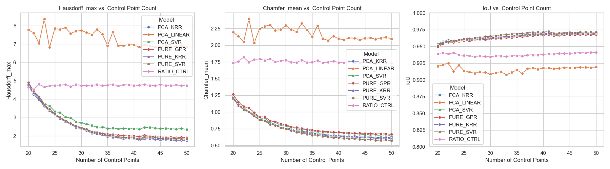

<div>

  # 👟 Shoe Shape Prediction AI

  **Machine Learning-Based Nonlinear Shoe Shape Prediction Across Multiple Sizes**
  <br/>

  <br/>

  
  
  
  

</div>

<br/>

## 1. Overview

This project presents a machine learning framework that predicts accurate shoe outlines for multiple sizes using only a single shoe image.

In conventional shoe manufacturing, size grading is typically performed using simple geometric scaling. However, human feet do not grow proportionally; for example, foot width does not increase linearly with foot length. Consequently, conventional scaling methods often produce unrealistic shoe shapes as the target size becomes larger.

To address this limitation, we propose a nonlinear regression-based prediction model that learns the geometric variation of shoe contours across different sizes. Given only a single shoe image (e.g., size 230 mm), the proposed model predicts accurate contours for other shoe sizes (e.g., 280 mm) while preserving realistic shape characteristics.

- **Development Period:** September 2025 – November 2025

<br/>

## 2. Repository Structure

```text
SHOE_PBL_PROJECT/
│
├── 20260106/                 # Experimental datasets
│   └── CTRL20 ~ CTRL50
│
├── origin_insole/            # Original shoe contour data
├── output_outlines/          # Predicted contour visualizations
│
├── 0_Master_Runner.py        # Run the complete pipeline
│
├── 1_Counter_Code.py         # Extract contour control points
├── 2_CounterToExcel_Vis_2026.py   # Export contour coordinates
│
├── 4_main_controller_2026.py      # Main prediction pipeline
├── 4_ratio_point_2026.py          # Ratio-based baseline
│
├── 5_aggregate_results_2026.py    # Aggregate prediction results
├── 5_Result_Visual_V8_All_2026.py        # Visualization
│
├── Fin_shape_prediction_lib_2026_V2.py   # Prediction library
├── visualization.py              # Additional visualization
└── README.md
```

## 3. How to Run

### Requirements

- Python 3.10+
- OpenCV
- NumPy
- Pandas
- Scikit-learn
- Matplotlib

### Execute

Run the complete pipeline using:

```bash
python 0_Master_Runner.py
```

The generated prediction results will be stored in:

```text
origin_insole/
output_outlines/
```


## 4. Key Features

The proposed framework provides the following core functionalities.

* **Auto Contour Extraction:** Automatically extracts accurate shoe contours from input images using OpenCV-based HSV masking while effectively removing background noise.
* **Cyclic Data Alignment:** Since contour coordinates extracted from different images start at arbitrary indices, a cyclic alignment algorithm is applied to synchronize all contour starting points with a reference contour.
* **Hybrid Shape Prediction:** A hybrid regression framework combines nonlinear kernel-based models (Kernel Ridge Regression and Support Vector Regression) for interpolation with linear regression for extrapolation, improving prediction stability outside the training range.
* **Monotonic Constraint:** To prevent physically implausible predictions (e.g., a larger shoe becoming shorter than a smaller one), a post-processing algorithm enforces monotonicity along the principal axis obtained by PCA.

<br/>

## 5. System Pipeline

The overall workflow consists of preprocessing, modeling, prediction, and visualization.

<div>
  <table>
    <tr>
      <th width="25%">Phase 1. Preprocessing</th>
      <th width="50%">Phase 2. Modeling & Prediction</th>
      <th width="25%">Phase 3. Evaluation</th>
    </tr>
    <tr>
      <td align="center" valign="top">
        <br/>
        📸 <b>Image Processing</b><br/>
        (HSV Masking & Contour)<br/>
        ⬇️<br/>
        🟢 <b>Normalization</b><br/>
        (Pixel to mm conversion)<br/>
        ⬇️<br/>
        🔄 <b>Cyclic Alignment</b><br/>
        (Data Phase Matching)
      </td>
      <td align="center" valign="top">
        <br/>
        🔀 <b>Feature Engineering</b><br/>
        (PCA & Vector Calculation)<br/>
        ⬇️<br/>
        🧠 <b>Hybrid Learning</b><br/>
        (Non-linear Kernel Ridge + Linear Regression)<br/>
        ⬇️<br/>
        📈 <b>Shape Reconstruction</b><br/>
        (Inverse PCA Transform)
      </td>
      <td align="center" valign="top">
        <br/>
        📐 <b>Physical Metrics</b><br/>
        (Length/Width Error Check)<br/>
        ⬇️<br/>
        🎯 <b>Geometric Metrics</b><br/>
        (IoU, Hausdorff Distance)<br/>
        ⬇️<br/>
        📊 <b>Visualization</b><br/>
        (Error Heatmap)
      </td>
    </tr>
  </table>
</div>

1.  **Preprocessing:**  Shoe contours are extracted from input images and aligned using the proposed cyclic alignment algorithm.
2.  **Modeling:** The aligned contour coordinates are projected into a low-dimensional latent space using Principal Component Analysis (PCA). The relationship between shoe size and principal components is then learned using machine learning models such as Kernel Ridge Regression (KRR) and Support Vector Regression (SVR).
3.  **Prediction:** The trained model predicts the contour of the target shoe size. A monotonic constraint is subsequently applied to eliminate physically inconsistent predictions before generating the final contour.

<br/>

## 6. Experimental Results

The proposed method was evaluated by comparing conventional ratio-based grading with machine learning models (KRR and SVR).



**Result Analysis**
* **Verification of Nonlinear Shape Variation:** Conventional ratio-based scaling gradually produced excessive width expansion as shoe size increased. In contrast, the proposed machine learning models significantly reduced width prediction errors and more accurately captured the nonlinear characteristics of shoe shape variation.
* **Optimal Number of Control Points:** Experimental results demonstrated that using **40–50 control points** provided the best balance between prediction accuracy and computational efficiency.

<br/>

## 7. Limitations and Future Work

**Limitations**
* **Instability in Extrapolation:** When predicting shoe sizes beyond the training range (230–270 mm), nonlinear RBF kernel models occasionally exhibited unstable extrapolation behavior.
* **Sensitivity to Initial Alignment:** Although cyclic alignment substantially reduced phase inconsistencies, large viewpoint distortions in the input images could still affect prediction accuracy.
* **Background Dependency:**   The current OpenCV-based contour extraction algorithm is sensitive to complex backgrounds and severe shadows, which may degrade contour quality.
* **Limited Dataset:** The available dataset contains a limited number of shoe styles and sizes, restricting the model's generalization capability.

**Future Work**
* **Data Augmentation:** Future work includes applying rotation, shearing, perspective transformation, and other augmentation techniques to improve robustness under various imaging conditions.
* **Extension to 3D Shape Reconstruction:** The current framework predicts only 2D shoe contours. Future research will extend the method to reconstruct full 3D shoe geometry by incorporating multi-view images or depth information.
